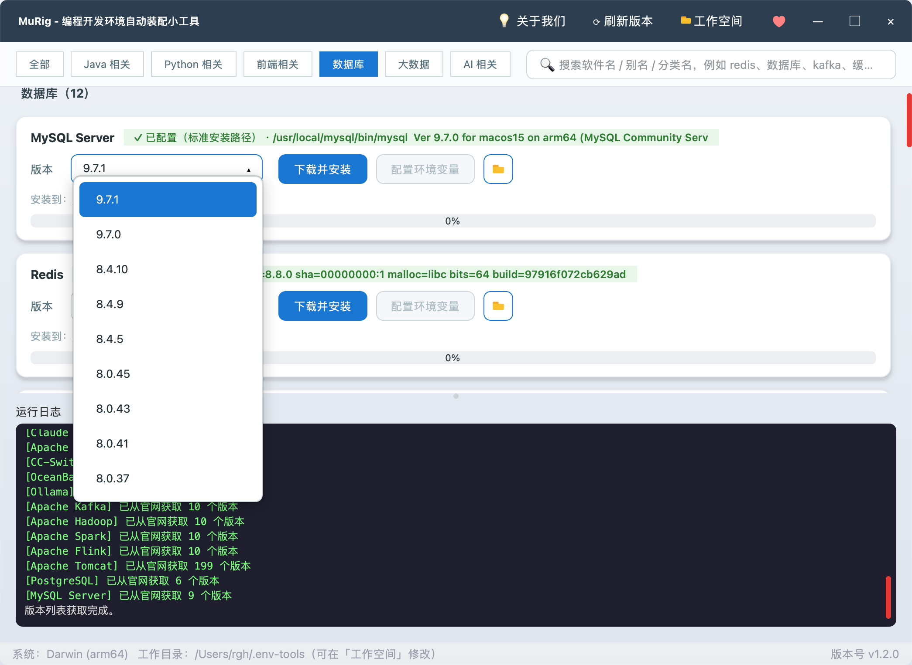
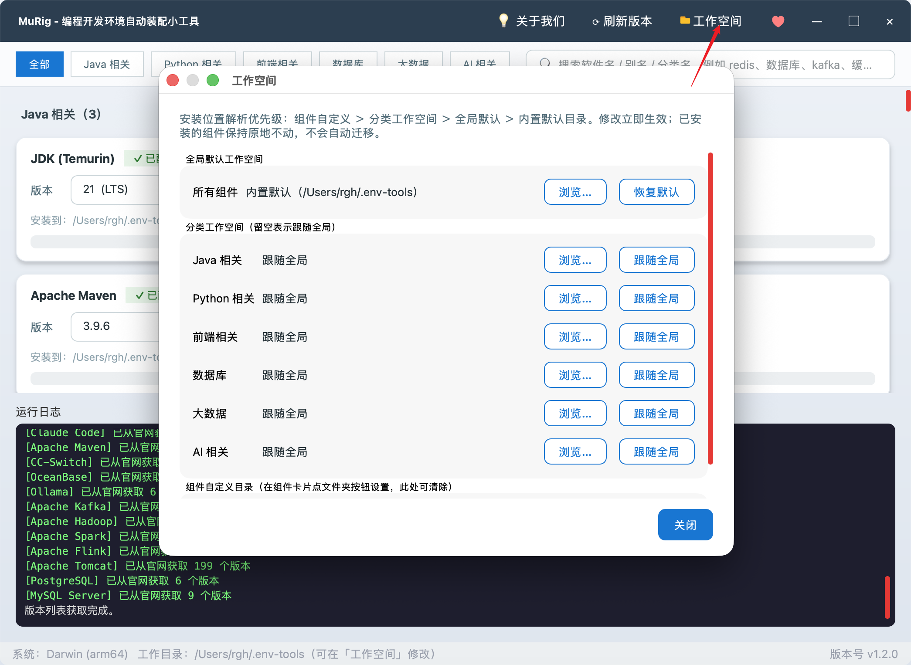

# MuRig · 编程开发环境自动装配小工具

<p align="center">
  
</p>

<p align="center">
  一款基于 <b>Python + PySide6</b> 的跨平台桌面 GUI 工具<br/>
  一键完成 <b>下载 → 解压 → 环境变量配置</b> 全流程，让开发环境搭建不再是重复劳动
</p>

<p align="center">
  
  
  
  
  <a href="https://github.com/vfaner/murig/releases"></a>
</p>

---

## 📥 下载即用（推荐）

> **不需要 Python 环境，不需要克隆源码，双击即可运行。** 到 **[Releases 页面](https://github.com/vfaner/murig/releases/latest)** 下载对应系统的版本：

| 系统 | 下载文件 | 说明 |
|------|----------|------|
| 🪟 **Windows** | [`murig.exe`](https://github.com/vfaner/murig/releases/latest/download/murig.exe) | 双击运行，无需安装 |
| 🍎 **macOS (Apple Silicon)** | [`murig-macos-arm64.zip`](https://github.com/vfaner/murig/releases/latest/download/murig-macos-arm64.zip) | 解压后双击 `murig.app` |
| 🍎 **macOS (Intel 芯片)** | [`murig-macos-x64.zip`](https://github.com/vfaner/murig/releases/latest/download/murig-macos-x64.zip) | 解压后双击 `murig.app` |
| 🐧 **Linux (x64)** | [`murig-linux-x64`](https://github.com/vfaner/murig/releases/latest/download/murig-linux-x64) | `chmod +x` 后直接运行 |

首次启动提示：

- **macOS**：未做代码签名，若提示"无法验证开发者"，到「系统设置 → 隐私与安全性」点击 **"仍要打开"**，或执行 `xattr -cr murig.app`
- **Windows**：SmartScreen 弹"未识别应用"时，点击 **"更多信息 → 仍要运行"**

---

## ✨ 功能特性

- 🖥️ **跨平台**：Windows / macOS / Linux，自动识别 x64 / arm64 并挑选正确的官方分发包
- 📦 **一键装配**：内置 29 个组件（语言运行时、构建工具、关系型/信创数据库、大数据全家桶、AI CLI），下载 → 解压（编译）→ 环境变量配置全流程自动化
- 🗂️ **分类与搜索**：六大分类胶囊一键筛选；搜索框支持软件名 / 别名（`es`、`缓存`）/ 分类名（`数据库`）模糊匹配
- 🌐 **动态版本**：后台向各官方 API / 归档拉取最新版本列表，下拉框可键入过滤；抓取失败自动回退内置清单，离线可用
- 🔍 **智能检测**：依次检查 `XXX_HOME` → `PATH` → 常见安装路径，已配置的组件显示 ✓ 且不会重复写入
- 🛠️ **环境变量写入**：Windows 走 `winreg` 直写注册表（规避 `setx` 1024 字符限制）；macOS/Linux 向 shell 配置写入带 marker 的幂等块
- 📁 **可配置工作空间**：全局 / 分类 / 单组件三级安装目录，见 [配置工作空间](#-配置工作空间安装目录)
- 🎨 **现代化 UI**：无边框窗口、圆角卡片、渐变进度条、四色分级日志
- 🧠 **偏好记忆**：记住每个组件上次选择的版本，下次启动自动恢复

---

## 📦 支持的组件

> 表中为离线默认版本；启动后后台会自动向官方源抓取最新版本覆盖。大数据组件均依赖 JDK，请先安装 JDK。

### ☕ Java 相关

| 组件 | 环境变量 | 默认版本 |
|------|----------|----------|
| JDK (Temurin) | `JAVA_HOME` | 21 / 17 / 11 / 8 |
| Apache Maven | `MAVEN_HOME` | 3.9.x / 3.8.x |
| Apache Tomcat | `CATALINA_HOME` | 10.1 / 9.0 / 8.5 |

### 🐍 Python 相关

| 组件 | 环境变量 | 默认版本 | 说明 |
|------|----------|----------|------|
| Python | —（走 PATH） | 3.12 / 3.11 / 3.10 / 3.9 | |
| Miniconda | `CONDA_HOME` | py312 / py311 / py310 | 静默安装器模式 |

### 🎨 前端相关

| 组件 | 环境变量 | 默认版本 | 说明 |
|------|----------|----------|------|
| Node.js | `NODE_HOME` | 20 LTS / 18 LTS / 16 | 安装 Claude Code 的前置条件 |
| Git | — | MinGit (Windows) / 系统自带 | |

### 🗄️ 数据库

| 组件 | 环境变量 | 默认版本 | 说明 |
|------|----------|----------|------|
| MySQL Server | `MYSQL_HOME` | 9.7 / 8.4 LTS / 8.0 | 需自行 `mysqld --initialize`；可识别标准安装路径 |
| MariaDB | `MARIADB_HOME` | 12.3 / 11.4 LTS / 10.11 LTS | 需自行初始化数据目录 |
| SQL Server 2025 Express | — | 2025 Express | 仅 Windows，官方在线引导程序向导安装 |
| PostgreSQL | `PG_HOME` | 18 / 17 / 16 | Linux 源码自动编译；需自行 `initdb` |
| Redis | `REDIS_HOME` | 8.4 / 7.4 / 7.2 | macOS/Linux 源码自动 `make` |
| Elasticsearch | `ES_HOME` | 8.15 / 7.17 | 别名 `es` |
| openGauss | `OPENGAUSS_HOME` | 7.0 / 6.0 | 仅 Linux |
| 达梦 DM8 | — | 滚动最新 | zip 套 ISO，自动解出并提示挂载安装 |
| OceanBase | `OB_HOME` | 4.4 / 4.3 | 仅 Linux，纯 Python 解包 RPM |
| TiDB | `TIDB_HOME` | 8.5 / 8.1 / 7.5 | 仅 Linux |
| KingbaseES | `KINGBASE_HOME` | V9R3C11 / V8R6C8 | 仅 Linux，便携 server 包自带 license |
| YashanDB | `YASHANDB_HOME` | 23.4.1 | 仅 Linux，`yasboot` 初始化 |

### 📊 大数据

| 组件 | 环境变量 | 默认版本 |
|------|----------|----------|
| Apache Hadoop | `HADOOP_HOME` | 3.5 / 3.4 / 3.3 |
| Apache ZooKeeper | `ZOOKEEPER_HOME` | 3.9 / 3.8 |
| Apache Hive | `HIVE_HOME` | 4.2 / 4.0 / 3.1 |
| Apache HBase | `HBASE_HOME` | 3.0 / 2.6 |
| Apache Spark | `SPARK_HOME` | 4.2 / 4.0 / 3.5 |
| Apache Flink | `FLINK_HOME` | 2.3 / 1.20 / 1.18 |
| Apache Kafka | `KAFKA_HOME` | 4.3 / 3.9 / 3.8 |

### 🤖 AI 相关

| 组件 | 环境变量 | 默认版本 | 说明 |
|------|----------|----------|------|
| Ollama | —（走 PATH） | 0.12 / 0.3 | 本地大模型运行工具 |
| Claude Code | `CLAUDE_CODE_HOME` | 跟随 npm 最新 | npm 便携安装（需先装 Node.js） |
| CC-Switch | — | 4.0.x | Claude 供应商切换；Win 便携版 / .app / AppImage |

> ℹ️ 官网无免登录直链、暂未收录的数据库：IBM DB2、瀚高 HighGo、海量 Vastbase、南大通用 GBase、神通 Oscar，需要时请自行到官网申请。

---

## 📸 截图预览

<p align="center">
  <br/>
  <sub>版本下拉框：版本列表实时抓自官方源，可键入关键字过滤</sub>
</p>

<p align="center">
  <br/>
  <sub>关于我们：联系方式与产品导航</sub>
</p>

---

## 🚀 快速开始（源码运行）

```bash
git clone https://github.com/vfaner/murig.git
cd murig
pip install -r requirements.txt   # PySide6 + requests
python main.py
```

- 需要 Python 3.9+；首次启动自动创建工作目录（默认 `~/.env-tools/`，可在「工作空间」修改）
- macOS/Linux 装 Redis、Linux 装 PostgreSQL 需要 `make` 与 C 编译器；装 Claude Code 需先装 Node.js

工作目录布局：

```
~/.env-tools/              # 可在「工作空间」改到任意盘
├── jdk/
│   ├── downloads/         # 原始压缩包
│   └── jdk-17/            # 解压后的组件
├── maven/
└── ...
```

---

## 📝 使用说明

1. **筛选（可选）**：点击分类胶囊，或在搜索框输入软件名 / 别名 / 分类名
2. **选择版本**：下拉框点选，或键入关键字（`21`、`3.12`、`LTS`）实时过滤
3. **下载并安装**：流式下载（可取消）→ 解压（源码包自动编译）→ 写入 `XXX_HOME` 并把 `bin` 追加到 `PATH`
4. **配置环境变量**：本地已下载的组件只执行环境变量配置
5. **查看日志**：底部日志区四色分级显示每一步执行情况

环境变量生效：Windows 新开终端即可；macOS/Linux 执行 `source ~/.zshrc`（或重开终端）。验证：`java -version`、`mvn -v`、`python --version`、`node -v`、`mysql --version`。

---

## 🔧 配置工作空间（安装目录）

组件默认装到内置目录 `~/.env-tools/`（Windows 下即 C 盘）。点击标题栏 **「工作空间」** 按钮打开设置弹窗，安装位置解析优先级：

1. **组件自定义**：组件卡片上的文件夹图标按钮单独指定（右键该按钮可清除）；
2. **分类工作空间**：为六大分类分别指定目录；
3. **全局默认**：一键修改所有组件的安装位置；
4. 均未设置时回退内置默认 `~/.env-tools/`。

<p align="center">
  
</p>

说明：

- 设置保存在 `~/.murig/config.json`，旧版 `~/.env-tools/config.json` 首次启动自动迁移；
- **已安装的组件原地不动**，环境变量仍指向旧路径，检测与使用不受影响；
- 下载缓存跟随当前工作空间，更换后未下载的组件需重新下载；
- 每张卡片的「安装到：…」实时显示该组件实际会安装到的目录。

---

## 🛠️ 自定义与打包

- **新增组件 / 版本**：编辑 `main.py` 的 `build_components()`；版本列表只是离线默认，启动后会被官方源抓取结果覆盖
- **更换镜像**：把 URL 前缀替换为华为云 `repo.huaweicloud.com`、清华 TUNA `mirrors.tuna.tsinghua.edu.cn` 或阿里云 `mirrors.aliyun.com`
- **本地打包**：`pip install pyinstaller && pyinstaller murig.spec --noconfirm --clean`
- **自动发布**：推 tag（如 `git tag v1.2.0 && git push origin v1.2.0`），GitHub Actions 在 Windows / macOS (arm64 + x64) / Linux 上打包并自动创建 Release

---

## ❓ 常见问题（FAQ）

**版本抓取失败 / 下载卡住？** 抓取失败自动回退内置版本列表，功能不受影响；下载卡住点「取消」重试，或按上文更换镜像。

**环境变量写入失败 / 会覆盖旧值吗？** Windows 默认写用户级变量，通常无需管理员权限，失败时以管理员身份重跑。重复安装会用最新路径覆盖 `XXX_HOME`，`PATH` 只追加不重复。

**MySQL 解压后能直接用吗？** 不能，还需自行 `mysqld --initialize`；本工具只负责下载 + 解压 + 环境变量。

**支持哪些归档格式？** `.zip`、`.tar.gz`、`.tar.xz`（MySQL Linux）、魔术字节识别的 `.tar`（KingbaseES 实为 gzip）、RPM（OceanBase，纯 Python 解包）、AppImage（需系统支持 FUSE）。

**安装 Claude Code 提示找不到 npm？** 先到「前端相关」分类安装 Node.js，再回到 Claude Code 卡片点击安装。

**信创数据库支持到什么程度？** openGauss / OceanBase / TiDB / KingbaseES / YashanDB 仅 Linux，自动下载并解包到工作目录；建用户、建数据目录等实例初始化按日志提示参照官方文档完成。

---

## 📁 目录结构

```
murig/
├── main.py                             # 主程序（UI + 全部逻辑）
├── requirements.txt                    # 依赖清单
├── murig.spec                          # PyInstaller 打包配置
├── README.md / README_EN.md            # 中文 / 英文说明
├── LICENSE                             # MIT 许可证
├── .github/workflows/
│   └── build-and-release.yml           # 四产物自动构建 + 发布
└── assets/                             # 截图与打赏码
    ├── murig.png                       # 主界面截图
    ├── murig_db_version.png            # 版本下拉框截图
    ├── murig_work.png                  # 工作空间弹窗截图
    ├── murig_about.png                 # 关于我们截图
    └── wechat.png / alipay.png / qq.png
```

---

## 💖 支持作者

如果这个小工具对你有帮助，欢迎请作者喝杯咖啡 ☕：

<table>
  <tr>
    <td align="center">
      <br/>
      <b>微信</b>
    </td>
    <td align="center">
      <br/>
      <b>支付宝</b>
    </td>
    <td align="center">
      <br/>
      <b>QQ</b>
    </td>
  </tr>
</table>

也欢迎 ⭐ Star、🐛 提 Issue、🔀 提 PR。

---

## 📄 许可证

本项目基于 **MIT License** 开源，版权所有 © 2026 [**沐编程**](https://nav.qqmu.com)。完整条款见 [LICENSE](LICENSE)。

---

<p align="center">
  Made with ❤️ by <b><a href="https://nav.qqmu.com">沐编程</a></b><br/>
  <sub>如果觉得有用，别忘了给个 ⭐ Star！</sub>
</p>
