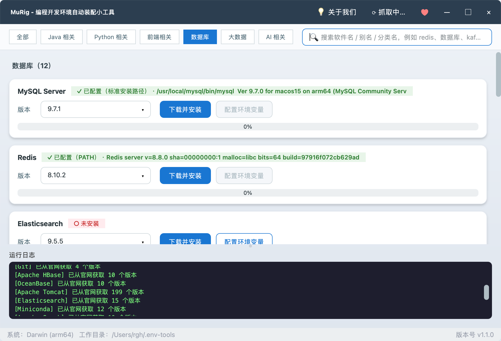

# MuRig · 编程开发环境自动装配小工具

<p align="center">
  
</p>

<p align="center">
  一款基于 <b>Python + PySide6</b> 的跨平台桌面 GUI 工具<br/>
  一键完成 <b>下载 → 解压 → 环境变量配置</b> 全流程，让开发环境搭建不再是重复劳动
</p>

<p align="center">
  
  
  
  
  <a href="https://github.com/vfaner/murig/releases"></a>
</p>

---

## 📥 下载即用（推荐）

> **不需要 Python 环境，不需要克隆源码，双击即可运行。**

请到 **[Releases 页面](https://github.com/vfaner/murig/releases/latest)** 下载对应操作系统的最新版本：

| 系统 | 下载文件 | 说明 |
|------|----------|------|
| 🪟 **Windows** | [`murig.exe`](https://github.com/vfaner/murig/releases/latest/download/murig.exe) | 双击运行，无需安装 |
| 🍎 **macOS (Apple Silicon)** | [`murig-macos-arm64.zip`](https://github.com/vfaner/murig/releases/latest/download/murig-macos-arm64.zip) | 解压后双击 `murig.app` |
| 🍎 **macOS (Intel 芯片)** | [`murig-macos-x64.zip`](https://github.com/vfaner/murig/releases/latest/download/murig-macos-x64.zip) | 解压后双击 `murig.app` |
| 🐧 **Linux (x64)** | [`murig-linux-x64`](https://github.com/vfaner/murig/releases/latest/download/murig-linux-x64) | `chmod +x` 后直接运行 |

### 首次启动提示

- **macOS**：由于未做代码签名，首次打开时系统可能提示"无法验证开发者"。请到「系统设置 → 隐私与安全性」下方点击 **"仍要打开"**；或用 `xattr -cr murig.app` 移除隔离属性。
- **Windows**：Defender / SmartScreen 可能弹出"未识别应用"，点击 **"更多信息 → 仍要运行"** 即可。
- **Linux**：如果双击无响应，请在终端执行 `chmod +x murig-linux-x64 && ./murig-linux-x64`。

> 💡 只想看看代码 / 自己二次开发？往下翻到 [开发者指南](#-快速开始)。

---

## 📖 目录

- [下载即用](#-下载即用推荐)
- [开发背景](#-开发背景)
- [项目描述](#-项目描述)
- [功能特性](#-功能特性)
- [支持的组件](#-支持的组件)
- [环境要求](#-环境要求)
- [快速开始](#-快速开始)（源码开发者）
- [使用说明](#-使用说明)
- [截图预览](#-截图预览)
- [配置与自定义](#-配置与自定义)
- [目录结构](#-目录结构)
- [常见问题（FAQ）](#-常见问题faq)
- [技术栈](#-技术栈)
- [支持作者](#-支持作者)
- [许可证](#-许可证)

---

## 🌱 开发背景

每次入职新公司、拿到一台新电脑、或者给同事讲解怎么搭建后端 / 前端开发环境，都要重复一系列繁琐的步骤：

1. **找官网** —— Oracle 现在要登录才能下 JDK？Adoptium Temurin 是哪个包才对？MySQL 官方的 zip 藏在哪个二级页面？
2. **对系统 / 架构** —— macOS 是 Intel 还是 Apple Silicon？Linux 用 glibc 哪个版本？
3. **解压 + 放到"正确"的位置** —— 一堆 `C:\Program Files\...` 还是 `~/tools/...` 的目录规划。
4. **配置环境变量** —— Windows 上要点开"高级系统设置 → 环境变量 → 用户变量 / 系统变量 → 新建"；macOS/Linux 要区分 `.zshrc`、`.bash_profile`、`.bashrc`、`.profile` 里到底写在哪个才生效。
5. **验证** —— 打开新终端 `java -version`、`mvn -v` …… 一个不对就重来。

一台电脑做完至少半小时，多台电脑或者带新人上手时更是重复劳动。**能不能把这些交给一个工具？** 于是有了这个项目：

> 让「新机器 → 一套完整开发环境」这件事变成 **点几下鼠标** 就搞定。

---

## 📌 项目描述

**MuRig** 是一款开源的桌面小工具，目标是把开发者最常用的语言运行时、构建工具、中间件的下载与配置全部自动化。

它做了这几件事：

- ✅ **智能识别系统**：自动判断 Windows / macOS / Linux + CPU 架构（x64 / arm64），挑选正确的官方分发包
- ✅ **动态版本抓取**：启动时向各官方 API / 归档索引拉取最新可用版本列表（Adoptium、Apache 归档、python.org、Node.js dist、GitHub Releases、Anaconda Repo、Redis、Elastic 等），不再依赖硬编码
- ✅ **六大分类 + 全局搜索**：组件按 **Java / Python / 前端 / 数据库 / 大数据 / AI** 分类组织；顶部搜索框支持按软件名、别名（如 `缓存`、`es`）或分类名（如 `数据库`、`大数据`）模糊搜索，也可点击分类胶囊快速筛选
- ✅ **可搜索下拉框**：版本列表长？直接键入 `21` / `3.12` / `LTS` 实时过滤
- ✅ **自动检测已装环境**：如果系统已经有 `java` / `mvn` / `python`，会显示 ✓ 已配置 状态并禁用"配置环境变量"按钮，避免重复写入
- ✅ **一键下载 → 解压 → 配环境变量**：Windows 下走 `winreg`，macOS/Linux 下带 marker 幂等写入 shell 配置文件
- ✅ **源码自动编译**：Redis / PostgreSQL 这类只提供源码包的组件，解压后自动执行编译
- ✅ **npm 便携安装**：Claude Code 这类 npm 包，自动安装到独立目录并配置 PATH，不污染全局
- ✅ **安装器模式**：Miniconda 这类 `.exe` / `.sh` 安装器，工具会以静默参数自动执行安装
- ✅ **RPM 纯 Python 解包**：OceanBase 等 RPM 包无需系统 rpm 工具，内置 xz/lzma + cpio 解析
- ✅ **现代化 UI**：无边框自定义标题栏、卡片式布局、分区标题、渐变进度条、彩色分级日志、状态胶囊标签

---

## ✨ 功能特性

| 特性 | 说明 |
|------|------|
| 🖥️ **跨平台** | 一份代码同时支持 Windows / macOS / Linux；ARM64 分支自动切换（如 Apple Silicon 下 JDK 走 aarch64、Node 走 arm64） |
| 📦 **一键装配** | 内置 **29 个** 常用开发组件，覆盖语言运行时、构建工具、关系型/信创数据库、大数据全家桶与本地大模型/AI CLI，从下载 → 解压（编译）→ 环境变量配置全流程自动化 |
| 🗂️ **分类与搜索** | 六大分类胶囊一键筛选；搜索框支持软件名 / 别名 / 分类名模糊匹配 |
| 🌐 **动态版本抓取** | 后台线程并发调用各组件官方 API / 索引，拉取最新可用版本，抓取失败自动降级到内置默认清单 |
| 🔍 **智能检测** | 优先检查 `XXX_HOME` 环境变量，然后回退到 `PATH` 中的可执行文件；探测到即视为已配置 |
| 🎯 **可搜索下拉框** | 版本多？直接键入关键字实时过滤，回车即可选中 |
| 🛠️ **环境变量写入** | Windows：`winreg` + `setx`；macOS/Linux：写入带标记的 shell 配置块，幂等更新 |
| 🚀 **安装器模式** | 支持 `.exe` / `.sh` 静默安装（Miniconda），无弹窗交互 |
| 📊 **实时反馈** | 进度条显示下载速度和大小，可随时取消；日志区彩色分级输出 |
| 🎨 **现代化界面** | 圆角卡片 + 阴影、渐变进度条、状态胶囊标签、无边框自定义窗口 |
| 🧠 **偏好记忆** | 记住上一次每个组件选择的版本，下次启动自动恢复 |
| 💰 **打赏支持** | 内置微信 / 支付宝 / QQ 二维码，一键支持作者 |

---

## 📦 支持的组件

### ☕ Java 相关

| 组件 | 显示名 | 环境变量 | 检测命令 | 默认版本 |
|------|--------|----------|----------|----------|
| **JDK** | JDK (Temurin) | `JAVA_HOME` | `java -version` | 21 / 17 (LTS) / 11 / 8 |
| **Maven** | Apache Maven | `MAVEN_HOME` | `mvn -v` | 3.9.x / 3.8.x |
| **Tomcat** | Apache Tomcat | `CATALINA_HOME` | `catalina version` | 10.1 / 9.0 / 8.5 |

### 🐍 Python 相关

| 组件 | 显示名 | 环境变量 | 检测命令 | 默认版本 |
|------|--------|----------|----------|----------|
| **Python** | Python | — (走 PATH) | `python --version` | 3.12 / 3.11 / 3.10 / 3.9 |
| **Miniconda** | Miniconda | `CONDA_HOME` | `conda --version` | py312 / py311 / py310 |

### 🎨 前端相关

| 组件 | 显示名 | 环境变量 | 检测命令 | 默认版本 |
|------|--------|----------|----------|----------|
| **Node.js** | Node.js | `NODE_HOME` | `node --version` | 20 LTS / 18 LTS / 16 |
| **Git** | Git | — | `git --version` | MinGit for Windows / 系统自带 |

### 🗄️ 数据库

| 组件 | 显示名 | 环境变量 | 检测命令 | 默认版本 | 说明 |
|------|--------|----------|----------|----------|------|
| **MySQL** | MySQL Server | `MYSQL_HOME` | `mysql --version` | 9.7 LTS / 8.4 LTS / 8.0 | 需自行初始化数据目录；可识别 `/usr/local/mysql`、`C:\Program Files\MySQL` 等标准安装路径 |
| **MariaDB** | MariaDB | `MARIADB_HOME` | `mariadb --version` | 12.3 / 11.4 LTS / 10.11 LTS | Win 免安装 zip / Linux systemd bintar；需自行初始化数据目录 |
| **SQL Server** | SQL Server 2025 Express | — | —（安装向导） | 2025 Express | **仅 Windows**，下载官方在线引导程序（约 4.5 MB），按向导安装 |
| **PostgreSQL** | PostgreSQL | `PG_HOME` | `psql --version` | 18 / 17 / 16 | Win/macOS 用 EDB 免安装包；Linux 源码自动编译；需自行 `initdb` |
| **Redis** | Redis | `REDIS_HOME` | `redis-server --version` | 8.4 / 7.4 / 7.2 / 6.2 | macOS/Linux 源码包自动 `make`；Windows 用社区移植版 |
| **Elasticsearch** | Elasticsearch | `ES_HOME` | `elasticsearch --version` | 8.15 / 7.17 | 别名 `es` |
| **openGauss** | openGauss | `OPENGAUSS_HOME` | `gsql --version` | 7.0 / 6.0 | **仅 Linux**，华为开源信创数据库；自动解出 Lite 版程序本体 |
| **达梦 DM8** | 达梦数据库 DM8 | — | —（GUI 安装） | 滚动最新构建 | Win/Linux 官方包为 zip 套 ISO，自动解出 ISO 并提示挂载安装 |
| **OceanBase** | OceanBase | `OB_HOME` | `observer -V` | 4.4 / 4.3 | **仅 Linux**，蚂蚁开源信创数据库；纯 Python 解包 RPM（xz + cpio） |
| **TiDB** | TiDB | `TIDB_HOME` | `tidb-server -V` | 8.5 / 8.1 / 7.5 | **仅 Linux**，PingCAP 分布式数据库（x86_64/ARM64）；包内为 tidb-server，学习可单机启动 |
| **人大金仓** | KingbaseES | `KINGBASE_HOME` | `ksql --version` | V9R3C11 / V8R6C8 | **仅 Linux**，官网免登录便携 server 包（自带 license），自动带 Referer 头通过防盗链 |
| **崖山** | YashanDB | `YASHANDB_HOME` | `yasql --version` | 23.4.1 | **仅 Linux**（x86_64/ARM64）；自动解出内层数据库包，`yasboot` 初始化 |

### 📊 大数据

| 组件 | 显示名 | 环境变量 | 检测命令 | 默认版本 |
|------|--------|----------|----------|----------|
| **Hadoop** | Apache Hadoop | `HADOOP_HOME` | `hadoop version` | 3.5 / 3.4 / 3.3 |
| **ZooKeeper** | Apache ZooKeeper | `ZOOKEEPER_HOME` | `zkServer version` | 3.9 / 3.8 |
| **Hive** | Apache Hive | `HIVE_HOME` | `hive --version` | 4.2 / 4.0 / 3.1 |
| **HBase** | Apache HBase | `HBASE_HOME` | `hbase version` | 3.0 / 2.6 |
| **Spark** | Apache Spark | `SPARK_HOME` | `spark-submit --version` | 4.2 / 4.0 / 3.5 |
| **Flink** | Apache Flink | `FLINK_HOME` | `flink --version` | 2.3 / 1.20 / 1.18 |
| **Kafka** | Apache Kafka | `KAFKA_HOME` | `kafka-topics --version` | 4.3 / 3.9 / 3.8 |

### 🤖 AI 相关

| 组件 | 显示名 | 环境变量 | 检测命令 | 默认版本 | 说明 |
|------|--------|----------|----------|----------|------|
| **Ollama** | Ollama | — (走 PATH) | `ollama --version` | 0.12 / 0.3 | 本地大模型运行工具；0.13 起官方改发 `.tar.zst`，故内置列表截至 0.12.9 |
| **Claude Code** | Claude Code | `CLAUDE_CODE_HOME` | `claude --version` | 跟随 npm 最新 | Anthropic 官方 AI 编程 CLI；通过本机 npm 便携安装（需先装 Node.js） |
| **CC-Switch** | CC-Switch | — | —（GUI 工具） | 4.0.x | Claude 供应商/镜像源一键切换工具；Win 便携版 / macOS .app / Linux AppImage |

> 💡 启动应用后，"⟳ 刷新版本"按钮会自动请求各官方源，拉取当前所有可用版本。抓取失败会回退到硬编码的内置清单，保证程序在离线环境下也可用。
>
> ⚠️ 大数据组件（Hadoop / Hive / HBase / Spark / Flink / Kafka）均依赖 **JDK**，请先安装 JDK；Hive / HBase 还需自行配置元数据服务（MySQL 等）。Windows 上运行 Hadoop 还需配合 [winutils](https://github.com/cdarlint/winutils)。
>
> ℹ️ **信创数据库说明**：openGauss / OceanBase / TiDB / KingbaseES / YashanDB 仅提供 Linux 包；达梦、OceanBase 等的安装器与实例初始化属于系统级操作（建用户、建数据目录等），本工具负责把官方分发包下载并解包到工作目录，并提示后续步骤。
>
> ℹ️ **引导安装卡片**：SQL Server 2025 Express 微软只提供在线引导程序（fwlink，约 4.5 MB，无便携包），本工具下载 exe 后请按向导完成安装；Linux/macOS 请使用 Docker 镜像 `mcr.microsoft.com/mssql/server`。
>
> ℹ️ **以下数据库官网无免登录直链，暂未收录**（需要时请自行前往官网申请）：
> - **IBM DB2**：Fix Central 强制 IBMid 登录（仅有公开的 ODBC CLI 驱动与 Docker 社区版 `icr.io/db2_community/db2`）
> - **瀚高 HighGo**：官网下载需姓名/手机号/短信验证码/邮箱
> - **海量 Vastbase**：申请需姓名/手机号/短信验证码/企业/MAC 地址，发 MAC 绑定的 90 天试用许可
> - **南大通用 GBase**：需登录并完成企业实名认证后才能申请下载
> - **神通 Oscar（神舟通用）**：下载页仅对登录用户开放，匿名无任何安装包

---

## 💻 环境要求

- **Python**：3.9 及以上
- **操作系统**：Windows 10 / 11、macOS 12+、Ubuntu 20.04+
- **网络**：需要能访问对应组件的下载源（如 Apache 归档、Adoptium API、Node.js dist 等）
- **磁盘**：视安装的组件而定，基础开发环境建议预留 3 GB 以上；若还要装大数据全家桶（Hadoop/Spark/Flink/Kafka 等每个 300 MB–1 GB），建议预留 10 GB 以上
- **编译环境**（macOS/Linux 安装 Redis 或 Linux 安装 PostgreSQL 时）：需要 `make` 与 C 编译器（Xcode Command Line Tools / gcc）
- **npm 环境**（安装 Claude Code 时）：需要先安装 Node.js（可用本工具安装）
- **特殊解压**：Linux AppImage（CC-Switch）需系统支持 FUSE；RPM（OceanBase）由工具内置纯 Python 解析，无需 `rpm2cpio`；KingbaseES 的 `.tar` 实为 gzip 压缩，由 tarfile 按 `r:*` 自动识别解包

---

## 🚀 快速开始

> 📌 **本节面向开发者 / 想二次开发的用户**。只想使用工具？请回到 [下载即用](#-下载即用推荐)。

### 1. 克隆项目

```bash
git clone https://github.com/yourname/murig.git
cd murig
```

### 2. 创建虚拟环境（推荐）

```bash
python -m venv .venv

# Windows
.venv\Scripts\activate

# macOS / Linux
source .venv/bin/activate
```

### 3. 安装依赖

```bash
pip install -r requirements.txt
```

依赖清单：

- `PySide6` — Qt for Python，提供跨平台 GUI
- `requests` — HTTP 请求，用于下载文件和抓取版本列表

### 4. 启动应用

```bash
python main.py
```

首次启动会自动创建工作目录：

```
~/.env-tools/          # 所有下载的压缩包 / 解压后的组件都放这里
├── jdk/
│   ├── downloads/     # 原始压缩包
│   └── jdk-17/        # 解压后的 JDK
├── maven/
├── node/
└── ...
```

---

## 📝 使用说明

### 基本流程

1. **打开应用** → 主界面按分类分区显示所有支持的组件卡片，每个卡片右上角会显示 **当前系统检测结果**：
   - 🟢 `✓ 已配置（PATH）· openjdk version "17.0.10"` — 系统已能找到，无需再装
   - 🟠 `● 已下载，未配置` — 本地已有安装包，但环境变量未设置
   - 🔴 `○ 未安装` — 完全没有

2. **筛选组件（可选）** → 点击顶部的分类胶囊（如「大数据」）只看该分类；或在搜索框输入软件名 / 别名 / 分类名（如 `redis`、`es`、`数据库`、`缓存`）实时过滤，分类与关键字可组合使用

3. **选择版本** → 点击版本下拉框：
   - 直接从列表点击选择
   - 或者输入关键字（如 `21`、`3.12`、`LTS`）实时过滤

4. **点击"下载并安装"** → 工具会：
   - ⬇️ 流式下载到 `~/.env-tools/<组件>/downloads/`（可随时取消）
   - 📂 解压到 `~/.env-tools/<组件>/<组件>-<版本>/`（Miniconda 走静默安装器）
   - 🔧 自动写入 `XXX_HOME` 环境变量 + 把 `bin` 追加到 `PATH`

5. **或点击"配置环境变量"** → 使用本地已下载的最新版本，仅执行环境变量配置

6. **查看日志** → 底部日志区实时显示每一步的执行情况（Redis 等源码包会在此显示编译输出）

### 环境变量生效方式

- **Windows**：新开命令行/PowerShell 窗口即可读到新的用户变量；已打开的窗口需要重启
- **macOS / Linux**：

  ```bash
  source ~/.zshrc        # 或 ~/.bashrc / ~/.bash_profile / ~/.profile
  ```

  或直接重开终端

### 验证方法

```bash
java -version
mvn -v
python --version
node -v
mysql --version
git --version
conda --version
```

---

## 📸 截图预览

<p align="center">
  
</p>

界面元素说明：

- **顶部**：自定义标题栏，包含 GitHub 链接、打赏按钮、窗口控制（最小化 / 最大化 / 关闭）
- **中部**：每个组件一张卡片，展示名称、状态标签、版本下拉框（可搜索）、操作按钮、进度条
- **底部**：运行日志区，四色分级输出（info 灰、ok 绿、warn 橙、error 红）
- **状态栏**：显示当前系统信息与工作目录

---

## 🔧 配置与自定义

### 修改 / 新增组件版本

打开 `main.py`，找到 `build_components()` 函数。每个组件的默认版本列表都在这里。如需新增或调整：

```python
components.append(
    Component(
        key="jdk",
        display_name="JDK (Temurin)",
        env_var="JAVA_HOME",
        path_subdir="bin",
        exec_name="java",
        version_args=["-version"],
        versions=[
            ComponentVersion(
                version=v,
                url_map=_adoptium_jdk_url(v),
                archive_map={"Windows": "zip", "Darwin": "tar.gz", "Linux": "tar.gz"},
            )
            for v in ("22", "21", "17", "11", "8")  # 加入 22
        ],
    )
)
```

> ⚠️ 提示：`versions` 只是**离线默认清单**。启动时后台会自动向官方 API 拉取真实版本，覆盖此清单。你也可以通过修改 `FETCHERS` 字典自定义抓取逻辑。

### 更换下载镜像

如果官方下载慢，可修改 `main.py` 中的 URL 生成函数，替换成国内镜像：

- 🇨🇳 **华为云**：`https://repo.huaweicloud.com/`
- 🇨🇳 **清华 TUNA**：`https://mirrors.tuna.tsinghua.edu.cn/`
- 🇨🇳 **阿里云**：`https://mirrors.aliyun.com/`

示例：把 Maven 的下载地址改成清华镜像

```python
def _maven_urls(v: str) -> Dict[str, str]:
    base = f"https://mirrors.tuna.tsinghua.edu.cn/apache/maven/maven-3/{v}/binaries/apache-maven-{v}-bin"
    return {
        "Windows": f"{base}.zip",
        "Darwin": f"{base}.tar.gz",
        "Linux": f"{base}.tar.gz",
    }
```

### 修改工作目录

默认工作目录是 `~/.env-tools/`。在 `main.py` 顶部修改：

```python
CONFIG_DIR = Path.home() / ".env-tools"
```

---

## 📦 自行打包 / 发布新版本

项目已经配置好 PyInstaller 与 GitHub Actions，你可以：

### 本地打包（单平台）

```bash
pip install pyinstaller
pyinstaller murig.spec --noconfirm --clean
```

产物：
- Windows：`dist/murig.exe`
- macOS：`dist/murig.app`
- Linux：`dist/murig`

### 自动发布三平台版本（推荐）

推一个 tag 到 GitHub，`.github/workflows/build-and-release.yml` 会在 Windows / macOS / Linux 三个 runner 上分别打包，并自动上传到对应 Release：

```bash
git tag v1.1.0
git push origin v1.1.0
```

几分钟后到 Releases 页面就能看到三个平台的产物。

---

## 📁 目录结构

```
murig/
├── main.py                             # 主程序（含 UI 与全部逻辑）
├── requirements.txt                    # Python 依赖清单
├── murig.spec                 # PyInstaller 打包配置
├── README.md                           # 中文说明（本文件）
├── README_EN.md                        # 英文说明
├── LICENSE                             # MIT 许可证
├── .gitignore                          # Git 忽略规则
├── .github/
│   └── workflows/
│       └── build-and-release.yml       # 三平台自动构建 + 发布
└── assets/                             # 静态资源
    ├── murig.png                       # 应用截图
    ├── wechat.png                      # 微信收款码
    ├── alipay.png                      # 支付宝收款码
    └── qq.png                          # QQ 收款码
```

---

## ❓ 常见问题（FAQ）

**Q1. 启动后下拉框显示"获取失败"？**
可能是网络原因或访问受限（如 GitHub API 在部分地区不稳定）。工具会自动回退到内置默认版本列表，仍然可以下载安装 —— 只是版本可能不是最新。**默认版本完全可用**。也可以更换镜像见「配置与自定义」章节。

**Q2. 下载卡在某个百分比不动？**
可能是网络原因或镜像限速。点击 **「取消」** 后重试；或参考"配置与自定义"章节替换成国内镜像。

**Q3. 提示环境变量写入失败？**
- Windows：请以"管理员身份"重新启动本程序（默认写入的是**用户级**变量，通常不需要管理员权限）
- macOS / Linux：确认你有 `~/.zshrc` 等文件的写入权限

**Q4. 已经存在旧的 `JAVA_HOME`，会被覆盖吗？**
会用最新一次安装的路径覆盖原有值；同时把新的 `bin` 目录追加到 `PATH`（不会重复追加）。

**Q5. MySQL 解压完成后能直接用吗？**
不能。MySQL 解压后还需要执行 `mysqld --initialize` 等初始化步骤。本工具只完成"下载 + 解压 + 环境变量"三步，不做数据库初始化。

**Q6. `.tar.xz` 归档能处理吗？**
可以，程序内置了 `tarfile.open("r:xz")` 逻辑（用于 MySQL Linux 版）。

**Q7. Windows 上 PATH 超过 1024 字符怎么办？**
`setx` 有 1024 字符限制，工具会额外通过 `winreg` 直接写入注册表来规避该限制。

**Q8. Miniconda 静默安装到哪里？**
安装到 `~/.env-tools/conda/conda-<版本>/`，并把 `CONDA_HOME` 与 `bin/Scripts` 加入环境变量。

**Q9. 可以只做检测不做安装吗？**
可以。启动时工具就会检测所有组件的状态；如果所有组件都显示 ✓ 已配置，说明你的系统已经就绪，不需要再点任何按钮。

**Q10. 支持自动更新组件版本吗？**
点击卡片的下拉框会先看到内置版本，程序启动后后台自动请求官网并热更新列表。所以理论上"最新版本"是实时的（前提是能访问对应官网）。

**Q11. `.rpm` / AppImage 能处理吗？**
RPM（如 OceanBase）内置纯 Python 解析（xz/lzma + cpio newc），无需系统安装 `rpm2cpio`；AppImage（如 Linux 版 CC-Switch）下载后自动赋可执行权限，运行需系统支持 FUSE。

**Q12. 安装 Claude Code 提示找不到 npm？**
请先在「前端相关」分类安装 Node.js（或自行安装 Node.js），再回到 Claude Code 卡片点击「安装」。

**Q13. 信创/国产数据库支持到什么程度？**
- openGauss（Linux）：自动下载 Lite 版并解出 `bin/gsql` 等程序本体；实例初始化可使用包内官方 `install.sh`。
- OceanBase（Linux）：自动下载官方 el7 RPM 并便携解包到工作目录；observer 的配置文件与数据目录需按官方文档准备。
- 达梦 DM8：官方包为 zip 套 ISO，工具自动解出 ISO；挂载后运行镜像内安装器（`DMInstall.bin -i`）完成安装。
- TiDB（Linux）：自动下载 `tiup-mirrors` 上的 tidb-server（x86_64/ARM64）；学习可 `--store=unistore` 单机启动，生产集群请用 tiup 部署 PD/TiKV。
- 人大金仓 KingbaseES（Linux）：自动从官网 CMS 获取免登录便携 server tar（标准 bin/lib 布局，自带 license.dat），下载自动带 Referer 头；初始化用 `initdb` / `sys_ctl`。
- 崖山 YashanDB（Linux）：自动从官网 API 获取 server 包并解出内层数据库 tar；`./install.sh`（yasboot init）初始化。
- DB2 / 瀚高 HighGo / 海量 Vastbase / 南大通用 GBase / 神通 Oscar：官网需登录或短信/实名申请、无公开直链，暂未收录。

**Q14. 后缀 `.tar` 的归档能处理吗？**
可以，程序对 `.tar` 使用 `tarfile.open("r:*")` 按魔术字节自动识别压缩格式——KingbaseES 便携包虽然后缀是 `.tar`，实际内容是 gzip 压缩 tar，也能正常解包（未压缩 tar 同样兼容）。解包时若归档内只有一个顶层目录会自动以它为安装根，没有包装目录（如 KingbaseES 直接是 bin/lib）时则以解压目录本身为安装根。

---

## 🛠️ 技术栈

- **Language**：Python 3.9+
- **GUI 框架**：[PySide6](https://doc.qt.io/qtforpython-6/)（Qt 6 官方 Python 绑定，LGPL 授权）
- **HTTP 客户端**：[requests](https://requests.readthedocs.io/)
- **压缩包解压**：Python 标准库 `zipfile` + `tarfile`
- **环境变量**：
  - Windows：`winreg` 直写注册表 + `setx` 通知系统
  - macOS/Linux：写入 shell 配置文件（`.zshrc` / `.bash_profile` / `.bashrc` / `.profile`）
- **多线程**：`QThread` 后台下载与版本抓取，UI 不阻塞
- **架构**：单文件应用，`main.py` 内含 UI、数据类、业务逻辑

---

## 💖 支持作者

如果这个小工具对你有帮助，欢迎请作者喝杯咖啡 ☕：

<table>
  <tr>
    <td align="center">
      <br/>
      <b>微信</b>
    </td>
    <td align="center">
      <br/>
      <b>支付宝</b>
    </td>
    <td align="center">
      <br/>
      <b>QQ</b>
    </td>
  </tr>
</table>

也欢迎：

- ⭐ 给本项目点个 Star
- 🐛 提 Issue 反馈问题
- 🔀 提 PR 贡献代码
- 📢 分享给身边的朋友

---

## 📄 许可证

本项目采用 **MIT License** 开源发布，版权归作者 **rgh** 所有。

```
MIT License

Copyright (c) 2026 rgh

Permission is hereby granted, free of charge, to any person obtaining a copy
of this software and associated documentation files (the "Software"), to deal
in the Software without restriction, including without limitation the rights
to use, copy, modify, merge, publish, distribute, sublicense, and/or sell
copies of the Software, and to permit persons to whom the Software is
furnished to do so, subject to the following conditions:

The above copyright notice and this permission notice shall be included in all
copies or substantial portions of the Software.

THE SOFTWARE IS PROVIDED "AS IS", WITHOUT WARRANTY OF ANY KIND, EXPRESS OR
IMPLIED, INCLUDING BUT NOT LIMITED TO THE WARRANTIES OF MERCHANTABILITY,
FITNESS FOR A PARTICULAR PURPOSE AND NONINFRINGEMENT. IN NO EVENT SHALL THE
AUTHORS OR COPYRIGHT HOLDERS BE LIABLE FOR ANY CLAIM, DAMAGES OR OTHER
LIABILITY, WHETHER IN AN ACTION OF CONTRACT, TORT OR OTHERWISE, ARISING FROM,
OUT OF OR IN CONNECTION WITH THE SOFTWARE OR THE USE OR OTHER DEALINGS IN THE
SOFTWARE.
```

许可证全文亦可参考 <https://opensource.org/licenses/MIT>。

---

<p align="center">
  Made with ❤️ by <b>rgh</b><br/>
  <sub>如果觉得有用，别忘了给个 ⭐ Star！</sub>
</p>
